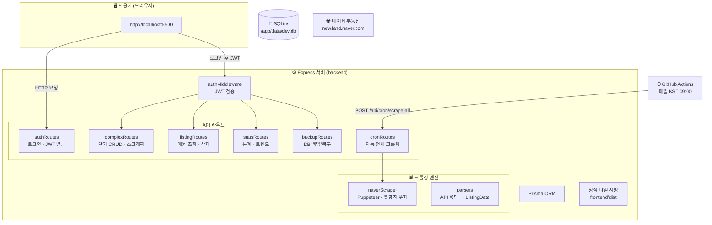
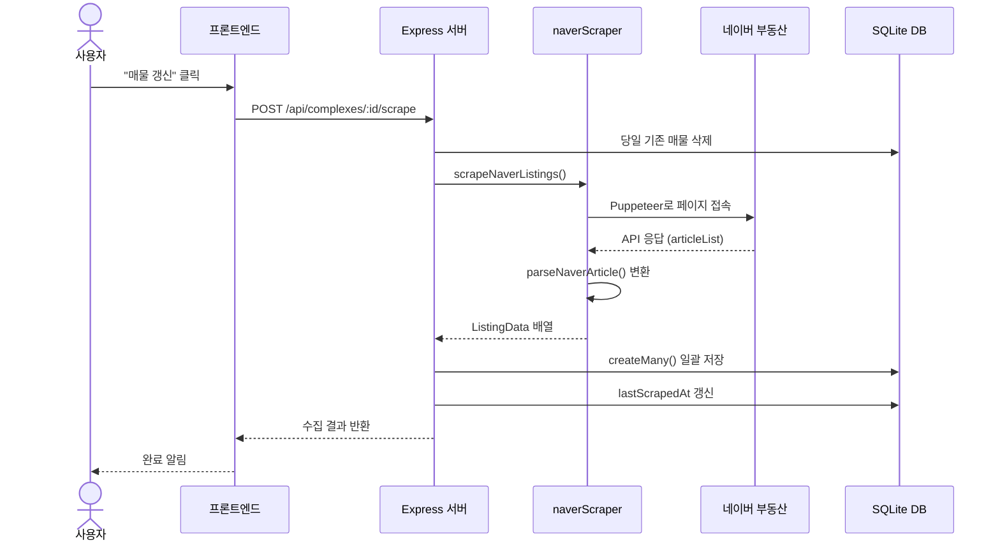
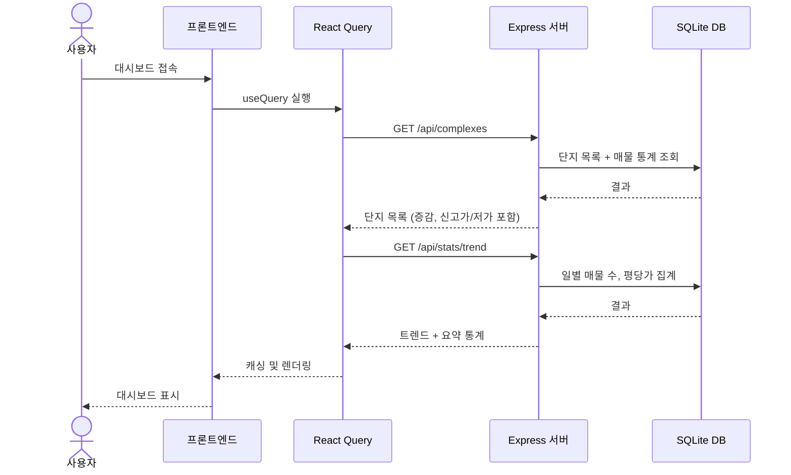
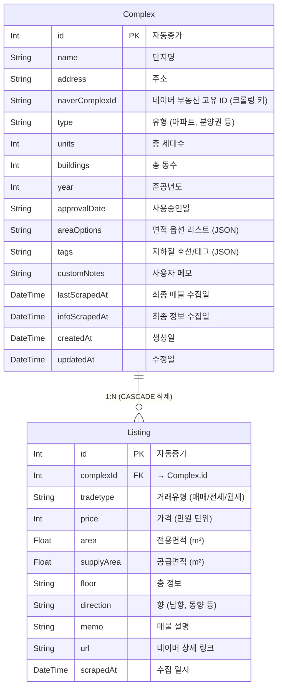

# 랜드브리핑 (LandBriefing)

**네이버 부동산 데이터를 나만의 자산으로 관리하는 스마트 대시보드**

랜드브리핑은 네이버 부동산의 아파트 정보를 크롤링하여 시계열 데이터로 저장하고, 시세 변화를 한눈에 파악할 수 있도록 돕는 로컬 기반 데이터 관리 도구입니다.

---

## ✨ 주요 기능

- **통합 상세 정보 관리**: 관심 단지의 세대수, 준공년도, 지하철 노선, 단지 메모 등을 원클릭으로 수집 및 관리
- **시계열 시세 차트**: 수집 누적 데이터 기반 매매/전세/월세 가격 변동 추이 시각화 (Recharts)
- **데이터 백업 및 공유**: 수집된 전체 데이터를 `.db` 파일로 내보내거나 가져오기 (다른 유저와 데이터 팩 공유 가능)
- **스마트 필터링 & 정렬**: 면적별, 거래유형별, 날짜별 필터와 다양한 정렬 기능 제공
- **강력한 스크래핑**: Puppeteer Stealth 모드를 적용하여 봇 감지를 최소화한 안정적인 수집
- **원클릭 실행기**: 별도의 터미널 명령어 없이 아이콘 클릭만으로 설치부터 실행까지 자동 완료

## 🚀 시작하기 (가장 쉬운 방법)

Windows 사용자라면 복잡한 명령어 없이 바로 시작할 수 있습니다.

1. **선행 조건**: [Node.js (LTS)](https://nodejs.org/)가 설치되어 있어야 합니다.
2. **실행**: 프로젝트 루트 폴더의 `LandBriefing.bat` 파일을 더블 클릭합니다.
   - 최초 실행 시 필요한 라이브러리 설치와 데이터베이스 설정을 자동으로 진행합니다.
   - 실행 후 브라우저에서 `http://localhost:5500`이 자동으로 열립니다.
3. **팁**: `LandBriefing.bat` 파일의 바로가기를 바탕화면에 만들어 편리하게 사용하세요.

## 🛠 기술 스택

### Frontend
- **Framework**: React 18, Vite
- **UI Component**: shadcn/ui (Official), Tailwind CSS, Lucide React
- **State**: TanStack Query (v5), Zustand (Global Alert & Header)
- **Auth**: `useAuth` 쮵, Axios JWT 인터셉터, `ProtectedRoute`
- **Timezone**: **대한민국 표준시(KST, UTC+9)** 고정 처리

### Backend
- **Runtime**: Node.js (Express)
- **Database**: SQLite (파일 기반 무설치 DB)
- **ORM**: Prisma
- **Scraping**: Puppeteer (Headless: "new", Stealth Patch)
- **Auth**: JWT (`jsonwebtoken`), Rate Limit (`express-rate-limit`)

### Infra (Railway)
- **Container**: Docker 멀티스테이지 빌드
- **DB 영속화**: Railway Volume (`/app/data`)
- **자동 크롤링**: GitHub Actions 스케줄러
- **비용**: Serverless 모드 활용, 월 ~$0.10

---

## 🏗 시스템 아키텍처



### 핵심 데이터 흐름

#### 1. 매물 수집 흐름


#### 2. 데이터 조회 흐름


---

## 📁 프로젝트 구조 (상세)

```
naver-land-scraper/
├── Dockerfile                     # 🐳 Railway Docker 빌드 (멀티스테이지, Chromium 포함)
├── .dockerignore                  # Docker 빌드 제외 파일 목록
├── railway.toml                   # Railway 배포 설정 (헬스체크 경로 등)
├── start.sh                       # 컨테이너 시작 스크립트 (DB 초기화 + 서버 실행)
├── .github/workflows/
│   └── daily-scrape.yml           # ⏰ 매일 KST 09:00 자동 크롤링 트리거
├── LandBriefing.bat               # 🚀 Windows 원클릭 실행기 (설치+빌드+서버 시작)
├── package.json                   # 루트 패키지 (concurrently로 dev 모드 통합 실행)
├── wait-for-server.js             # 서버 기동 대기 후 브라우저 자동 오픈
├── CLAUDE.md                      # AI 페어 프로그래밍 컨벤션 문서
├── SPEC.md                        # 기술 명세서 (아키텍처, 데이터 모델, API)
│
├── backend/                       # ─── 백엔드 (Express + Prisma + Puppeteer) ───
│   ├── package.json               # 백엔드 의존성 (express, prisma, puppeteer 등)
│   ├── tsconfig.json              # TypeScript 설정
│   ├── .env                       # 환경변수 (DATABASE_URL)
│   │
│   ├── prisma/                    # 📦 데이터베이스 스키마 및 파일
│   │   ├── schema.prisma          #   DB 모델 정의 (Complex, Listing)
│   │   ├── dev.db                 #   SQLite 데이터베이스 파일 (실 데이터)
│   │   └── migrations/            #   Prisma 마이그레이션 이력
│   │
│   ├── backups/                   # 💾 서버 시작 시 자동 생성되는 DB 백업 (최대 5개)
│   ├── uploads/                   # 📤 DB 복구용 임시 업로드 디렉토리
│   │
│   └── src/                       # 📂 백엔드 소스 코드
│       ├── index.ts               #   🔑 서버 엔트리포인트 (Express 초기화, 라우트 등록,
│       │                          #      정적 파일 서빙, 자동 DB 백업)
│       ├── db.ts                  #   🔗 Prisma 클라이언트 싱글턴 (DB 연결 관리)
│       │
│       ├── scrapers/              #   🕷 네이버 부동산 크롤링 엔진
│       │   ├── naverScraper.ts    #     Puppeteer 기반 스크래퍼 (봇감지 우회, 단지정보/
│       │   │                      #     매물 목록 수집, 재시도 로직, 스크롤 기반 로딩)
│       │   ├── parsers.ts         #     네이버 API 응답 → ListingData 변환 파서
│       │   │                      #     (가격 "X억 Y" 파싱, 층 정보 추출 등)
│       │   └── parsers.test.ts    #     파서 단위 테스트
│       │
│       ├── routes/                #   🛣 API 라우트 핸들러
│       │   ├── authRoutes.ts      #     로그인(JWT 발급), 토큰 검증
│       │   ├── cronRoutes.ts      #     자동 전체 크롤링 (CRON_SECRET 인증)
│       │   ├── complexRoutes.ts   #     단지 CRUD, 매물 스크래핑, 전체 수집, 엑셀 내보내기,
│       │   │                      #     테스트 단지 생성, 신고가/저가 계산 포함
│       │   ├── listingRoutes.ts   #     매물 조회(필터/정렬), 단건/다건/전체 삭제,
│       │   │                      #     신고가/저가 플래그 부여, 더미 데이터 생성
│       │   ├── statsRoutes.ts     #     대시보드 트렌드 (일별 매물 수/평단가),
│       │   │                      #     신고가/저가 매물 상세 목록 조회
│       │   ├── statsRoutes.test.ts#     통계 라우트 단위 테스트
│       │   └── backupRoutes.ts    #     DB 백업 다운로드, DB 복구 업로드
│       │                          #     (SQLite 헤더 검증 포함)
│       │
│       ├── middleware/            #   🔒 Express 미들웨어
│       │   └── authMiddleware.ts  #     JWT Bearer 토큰 검증 (보호 라우트 적용)
│       │
│       ├── utils/                 #   🔧 공통 유틸리티
│       │   ├── index.ts           #     배럴 파일 (re-export)
│       │   ├── dateUtils.ts       #     KST(UTC+9) 날짜 계산 (오늘/어제 범위 등)
│       │   ├── dateUtils.test.ts  #     날짜 유틸 테스트
│       │   ├── statsUtils.ts      #     매물 통계 집계 (유형별 카운트, 증감 계산)
│       │   └── statsUtils.test.ts #     통계 유틸 테스트
│       │
│       └── types/                 #   📝 타입 정의
│           └── index.ts           #     Complex, Listing, ListingData, ComplexInfo
│
├── frontend/                      # ─── 프론트엔드 (React + Vite + shadcn/ui) ───
│   ├── package.json               # 프론트엔드 의존성
│   ├── vite.config.ts             # Vite 빌드 설정 (프록시: /api → localhost:5050)
│   ├── tailwind.config.js         # Tailwind CSS 설정 (shadcn/ui 테마 포함)
│   ├── tsconfig.json              # TypeScript 설정 (경로 별칭 @/)
│   ├── components.json            # shadcn/ui 컴포넌트 설정
│   ├── index.html                 # SPA 엔트리 HTML
│   ├── dist/                      # 🏗 프로덕션 빌드 결과 (Express가 서빙)
│   │
│   └── src/                       # 📂 프론트엔드 소스 코드
│       ├── main.tsx               #   🚀 React 앱 최상위 초기화
│       │                          #     (QueryClient 설정, StrictMode 렌더링)
│       ├── App.tsx                #   🗺 라우트 정의 (/, /complex/:id, /trend, /records)
│       ├── index.css              #   🎨 Tailwind 기본 스타일 + CSS 변수
│       │
│       ├── pages/                 #   📄 페이지 컴포넌트 (라우트별 1:1 매칭)
│       │   ├── LoginPage.tsx      #     🔑 로그인 페이지 (JWT 인증 진입점)
│       │   ├── ComplexList.tsx    #     📊 대시보드 (단지 카드 그리드, 요약 통계,
│       │   │                      #        단지 추가/수정 폼, 데이터 관리)
│       │   ├── ComplexDetail.tsx  #     🏠 단지 상세 (단지 정보 + 시세 차트 +
│       │   │                      #        매물 필터 + 매물 테이블)
│       │   ├── Trend.tsx          #     📈 전체 추세 분석 (평단가 라인차트,
│       │   │                      #        유형별 바차트, 일자별 데이터 테이블)
│       │   ├── Records.tsx        #     🏅 신고가/신저가 매물 테이블
│       │   └── Trend.test.tsx     #     Trend 페이지 테스트
│       │
│       ├── components/            #   🧩 재사용 컴포넌트
│       │   ├── Layout.tsx         #     📐 공통 레이아웃 (헤더 + 네비게이션 + 뒤로가기)
│       │   │
│       │   ├── complex/           #     🏢 단지(Complex) 도메인 컴포넌트
│       │   │   ├── ComplexCard.tsx          # 대시보드의 단지 카드 (정보 요약 + 증감)
│       │   │   ├── ComplexCard.test.tsx     # ComplexCard 테스트
│       │   │   ├── ComplexForm.tsx          # 단지 추가/수정 폼 (지하철 체크박스)
│       │   │   ├── ComplexInfo.tsx          # 단지 상세 정보 패널 (수정/삭제 인라인)
│       │   │   ├── ComplexListHeader.tsx    # 대시보드 상단 버튼 바 (정렬/수집/엑셀)
│       │   │   ├── DataManagementSection.tsx# DB 백업/복구 UI (다운로드/업로드)
│       │   │   ├── ListingChart.tsx         # 📊 시세 시계열 차트 (Recharts)
│       │   │   ├── ListingFilters.tsx       # 매물 필터 UI (유형/날짜/면적)
│       │   │   └── ListingTable.tsx         # 매물 목록 테이블 (정렬/배치삭제)
│       │   │
│       │   ├── stats/             #     📉 통계 관련 컴포넌트
│       │   │   ├── DashboardSummary.tsx     # 대시보드 요약 카드 (매물 수, 평단가 등)
│       │   │   └── DashboardSummary.test.tsx# DashboardSummary 테스트
│       │   │
│       │   └── ui/                #     🎨 shadcn/ui 기본 컴포넌트 (16개)
│       │       ├── alert-dialog.tsx, badge.tsx, button.tsx, card.tsx,
│       │       │── checkbox.tsx, dialog.tsx, dropdown-menu.tsx,
│       │       │── GlobalAlert.tsx (커스텀 전역 알림),
│       │       │── input.tsx, label.tsx, popover.tsx, select.tsx,
│       │       │── separator.tsx, table.tsx, tabs.tsx, textarea.tsx
│       │       └── ...
│       │
│       ├── hooks/                 #   🪝 커스텀 훅 (비즈니스 로직 분리)
│       │   ├── useAuth.ts         #     인증 상태 관리 (JWT 로그인/로그아웃, 토큰 검증)
│       │   ├── useComplexList.ts  #     대시보드 로직 (단지 CRUD, 정렬, 전체 수집,
│       │   │                      #     엑셀 내보내기, 테스트 단지 생성)
│       │   └── useComplexDetail.ts#     단지 상세 로직 (매물 조회/필터/정렬,
│       │                          #     스크래핑, 정보 갱신, 엑셀 내보내기)
│       │
│       ├── lib/                   #   📚 유틸리티 라이브러리
│       │   ├── api.ts             #     Axios API 클라이언트 (complexApi, listingApi,
│       │   │                      #     statsApi, backupApi 함수 모음)
│       │   ├── format.ts          #     데이터 포맷터 (가격→억원, m²→평, KST 날짜)
│       │   ├── store.ts           #     Zustand 전역 상태 (Alert 모달, Header 제어)
│       │   ├── constants.ts       #     상수 (지하철 노선 목록 + 노선별 색상 코드)
│       │   └── utils.ts           #     범용 유틸 (tailwind cn 머지, Blob 다운로드)
│       │
│       ├── types/                 #   📝 프론트엔드 타입 정의
│       │   └── index.ts           #     Complex, Listing, TrendData, PriceRecord 등
│       │
│       └── test/                  #   🧪 테스트 설정
│           └── setup.ts           #     Vitest 설정
│
└── node_modules/                  # 루트 의존성 (concurrently)
```

### 📊 데이터 모델 (Prisma Schema)



---

## 📄 주요 페이지 구성

| 경로 | 페이지 | 주요 기능 |
|:---|:---|:---|
| `/` | 대시보드 (ComplexList) | 단지 카드 목록, 요약 통계, 단지 추가/수정, 전체 수집, 데이터 관리 |
| `/complex/:id` | 단지 상세 (ComplexDetail) | 단지 정보 편집, 시세 차트, 매물 필터링 테이블, 매물 갱신/엑셀 |
| `/trend` | 추세 분석 (Trend) | 평균 평당가 라인차트, 유형별 매물 수 바차트, 일자별 테이블 |
| `/records?type=high\|low` | 신고가/저가 (Records) | 30일 대비 신고가/저가 갱신 매물 테이블 |

---

## 💾 데이터 백업 및 복구

메인 화면 하단의 **[데이터 매니지먼트]** 섹션에서 다음 작업이 가능합니다.

- **내보내기**: 지금까지 수집한 모든 단지 정보와 시세 데이터를 `.db` 파일로 저장합니다. 
- **불러오기**: 다른 컴퓨터에서 사용하던 데이터나 친구가 공유해 준 데이터를 내 앱에 즉시 반영합니다.

## ⚠️ 주의사항

- 이 도구는 **개인적인 학습 및 데이터 분석용**으로 제작되었습니다.
- 네이버 부동산 서비스에 과도한 부하를 줄 경우 사이트 이용이 제한될 수 있으므로 주의해 주세요.
- 비정상적인 대량 수집 행위는 관련 법령이나 서비스 이용약관에 저촉될 수 있습니다.

## 📝 라이선스
MIT License
